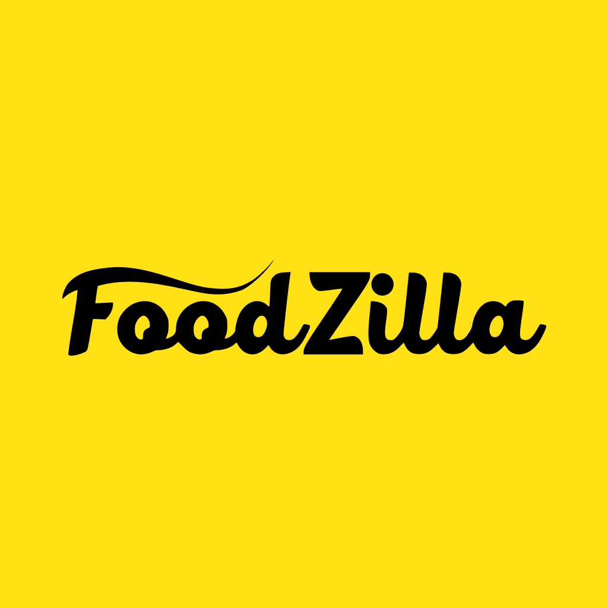

<!-- PROJECT LOGO -->
<br />
<p align="center">
  <a href="https://github.com/othneildrew/Best-README-Template">
    
  </a>

  <h3 align="center">FoodZilla MS AI</h3>

  <p align="center">
    Uma infraestrutura poderosa
    <br />
    <a href="https://github.com/LostTechSoftware/ms_ai/wiki"><strong>Veja a documentação »</strong></a>
    <br />
    <br />
    <a href="https://ms_ai.foodzilla.com.br">View Prod</a>
    ·
    <a href="https://staging-ms_ai.foodzilla.com.br">View staging</a>
    ·
    <a href="https://helpcenter.foodzilla.com.br">Report Bug</a>
  </p>
</p>

<!-- TABLE OF CONTENTS -->
<details open="open">
  <summary>Table of Contents</summary>
  <ol>
    <li>
      <a href="#about-the-project">About The Project</a>
      <ul>
        <li><a href="#built-with">Built With</a></li>
      </ul>
    </li>
    <li>
      <a href="#getting-started">Getting Started</a>
      <ul>
        <li><a href="#prerequisites">Prerequisites</a></li>
        <li><a href="#installation">Installation</a></li>
      </ul>
    </li>
    <li><a href="#usage">Usage</a></li>
    <li><a href="#roadmap">Roadmap</a></li>
    <li><a href="#contributing">Contributing</a></li>
    <li><a href="#license">License</a></li>
    <li><a href="#contact">Contact</a></li>
    <li><a href="#acknowledgements">Acknowledgements</a></li>
  </ol>
</details>

<!-- ABOUT THE PROJECT -->

## About The Project

[![Product Name Screen Shot][product-screenshot]](https://example.com)

IA construida buscando determinar processos e lógicas complexas para garantir mais confiabilidade na plataforma.

### Built With

Aqui vemos uma das mais poderosas ferramentas usadas pelo Backend

- [Nodejs](https://nodejs.dev)
- [Express](https://expressjs.com)
- [AWS](https://aws.amazon.com)
- [SQS](https://docs.aws.amazon.com/sqs/index.html)
- [Cron](https://crontab.guru)
- [Coralogix](https://coralogix.com)
- [Sentry](https://sentry.io)

<!-- GETTING STARTED -->

## Getting Started

Para iniciar o projeto é necessário seguir os passos abaixo:

### Prerequisites

É preciso ter heroku-cli e yarn

- yarn

  ```sh
  npm install --global yarn
  ```

- heroku-cli

  ```sh
  npm install -g heroku
  ```

### Installation

1. Clone the repo
   ```sh
   git clone https://github.com/LostTechSoftware/bk_clientes
   ```
2. Install packages
   ```sh
   yarn
   ```
3. Clone environment keys
   ```JS
   heroku config -a foodzilla-staging-ms_ai -s >> .env
   ```

<!-- USAGE EXAMPLES -->

## Usage

Usado para toda a infraestrutura do FoodZilla.

_For more examples, please refer to the [Documentation](https://github.com/LostTechSoftware/ms_ai/wiki)_

<!-- ROADMAP -->

## Roadmap

See the [PRs](https://github.com/LostTechSoftware/ms_ai/pulls) for a list of proposed features (and known issues).

<!-- CONTRIBUTING -->

## License

Distributed under the MIT License. See `LICENSE` for more information.

<!-- CONTACT -->

<!-- MARKDOWN LINKS & IMAGES -->

[product-screenshot]: images/screenshot.png
